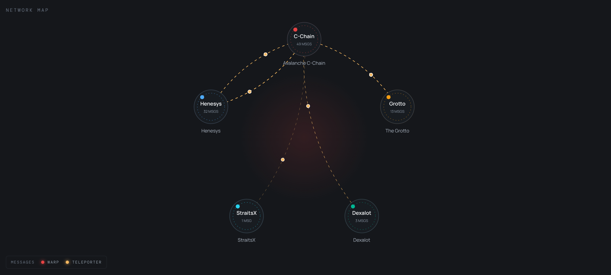

# Avalanche ICM Visualizer

A focused, read-only visualization of Interchain Messaging traffic between Avalanche L1s.



## Run locally

```bash
pnpm install
pnpm dev
```

Open `http://localhost:3000`. The application reads live Avalanche data from the configured RPC endpoints.

The application uses public, read-only RPC endpoints directly from the browser. RPC providers may enforce rate limits, CORS rules, or availability policies; use endpoints you are authorized to access for production deployments.

## Data modes

Live traffic requires configured RPC endpoints and protocol contract addresses on the supplied chain configuration; the UI reports unavailable or failed live sources without fabricating traffic.

Displayed traffic is observational and depends on the configured RPC providers. It may be delayed, incomplete, or unavailable, and should not be treated as an authoritative record of message delivery.

## Verification

```bash
pnpm lint
pnpm typecheck
pnpm build
```

Custom chains are stored locally in the browser. Useful network and filter state can be shared through URL query parameters, including a selected message.

## Production check

```bash
pnpm build
pnpm start
```

This project is released under the [MIT License](LICENSE).
